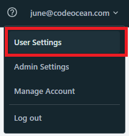
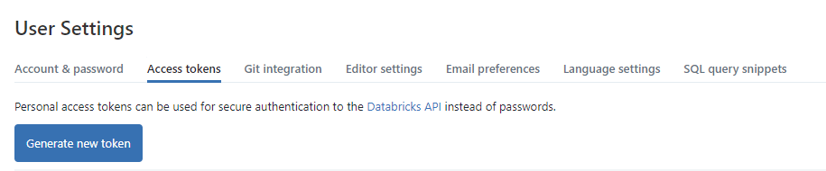
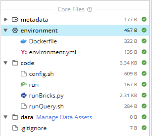
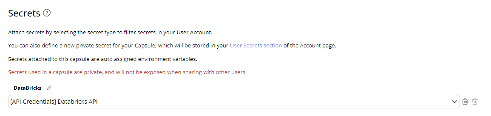
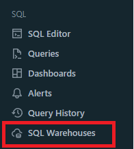
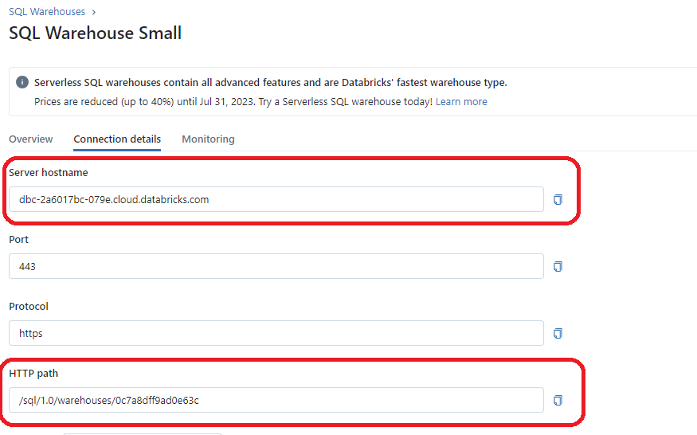
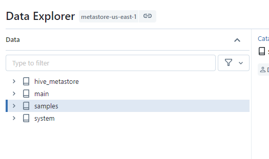

  
# DataBricks - Python - Data Connector

This tool is designed to create a connection between Code Ocean and your SQL Warehouse in Databricks. 

## Configuration

### Get Databricks API token

If you have not done so, in your Databricks Workspace:

1. Go to User Settings, Access Tokens, Generate a New Token.

2. Save the key and secret.

### Create Databricks Secret in Code Ocean

1. Navigate to the bottom left of icon "Account" on your screen.

2. Select User Secrets
3. Press Add Secret->API Credentials
4. Add Key and Secret from Databricks. Note that the "Secret" portion is the Databricks API token, the key is not used. 

Attaching to this Capsule
1. In the capsule, press on Environment. 

2. Scroll to the bottom. 
3. In the "Secrets" section

4. Select your Key listed for Databricks. 

### Get Warehouse Information from Databricks

In your Databricks workspace, go to SQL Warehouse. Select your warehouse. Press Connection Details.
Use these as input for this capsule.

- Hostname
- HTTPPath

In your Databricks account, go to Data, select the dataset you wish to query, and get "Catalog" name.

- Catalog
      

## App Panel Parameters

Hostname
- Workspace hostname, see [Get Parameter Information from Databricks](## Get Parameter Information from Databricks) [default: dbc-2a6017bc-079e.cloud.databricks.com]

HTTPPath
- Workspace hostname, see [Get Parameter Information from Databricks](## Get Parameter Information from Databricks) [default: /sql/1.0/warehouses/0c7a8dff9ad0e63c]

Catalog
- SQL warehouse catalog, see [Get Parameter Information from Databricks](## Get Parameter Information from Databricks) [default: hive_metastore]

SQL Query
- SQL Query to execute. This should be a "SELECT" statement pulling data from the warehouse. [default: SELECT * FROM default.diamonds LIMIT 2]

Output File Name
- Name for output file, does not include extension [default: output]

Output Format
- Data format to output. [default: csv]

## Output

**output.csv**: A table of your SQL query requested in csv/tsv/parquet/json/excel forma. Output name based on Ouptut File Name and Format.

**output**: Stdout/stderr from the query. 

## Source

https://docs.databricks.com/dev-tools/python-sql-connector.html

[Code Ocean](https://codeocean.com/) is a cloud-based computational platform that aims to make it easy for researchers to share, discover, and run code.  
